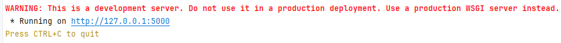

# python_student
This is project final for python subject of MSE

Anh em dùng window chạy từng câu lệnh dưới

Mở terminal: Alt + F12

B1: set FLASK_APP=Application.py

B2: $env:FLASK_APP = "Application.py" 

B3: flask run

Terminal xuất hiện url web là ngon rồi

API này viết tạm đúng flow: có thể tham khảo nhé

@app.route('/student/<studentId>')
def getStudentById(studentId):
    studentService.getStudentById(studentId)
    return studentId + ""

=============================

DB đã thêm r. Mng thấy sai hay thiếu field thì bổ sung 
ở schema.sql nhé

$env:FLASK_DEBUG = "1" để bật debug mode